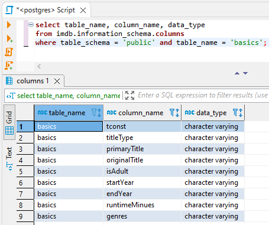

## Hw 07
### Amir ElTabakh
### 04/08/2022 4:00 PM

 1. Exercise 
When you imported the IMDB tables in the last homework, we used varchar values for every destination table. We did this because we wanted to ensure that the COPY command doesn't run into data integrity errors. These tables with varchar data types don't lend themselves well for future analysis. We will create a view for each table where we ensure that the data types are more conducive to analysis.  

Step 1: Run the script below to make sure that all fields are varchar values in your first table (title_basic)

        select table_name, column_name, data_type 
        from IMDB.information_schema.columns
        where  table_schema = 'public' and table_name = 'title_basic';

Step 1 Answer:

Step 2: With the help of the online [IMDB documentation](https://www.imdb.com/interfaces/) create views for every table where you cast every column to the matching target data type.
Below you can see the title_basic view as an example.

    create view imdb.public.etl_title_basic_v
    as
    select 
     tb.tconst
    ,tb.titletype
    ,tb.primarytitle
    ,tb.originaltitle
    ,cast(tb.isadult as boolean) as isadult
    ,cast(tb.startyear as integer) as startyear
    ,cast(tb.endyear as integer) as endyear
    ,cast(tb.runtimeminutes as integer) as runtimeminutes
    ,regexp_split_to_array(tb.genres,',')::varchar[] as genres       
    from imdb.public.title_basic tb;

Keep the title_akas.types column as varchar for the time being.

Notice that the last column, `genres`, is of a data type array in the document. We had it import it as regular text. However, it can be interpreted as a comma-separated array. Here I used the [regexp_split_to_array](https://www.postgresql.org/docs/9.4/functions-string.html)  function to turn the varchar string into an array. The function requires a varchar column and a separator as input to produce the array.

Have a separate SQL file for every table.

Step 3: Create a physical table using the views from step 2. Use the `xf_` prefix to differentiate these new tables (with the correct data types) from the raw imported tables.

    create table imdb.public.xf_title_basic
    as
    select * from imdb.public.etl_title_basic_v;

Step 4: Use the `ALTER TABLE` statements from the previous homework to establish the primary and foreign key relationships.

#### Exercise 1 Answer:

I do steps 2, 3 and 4 in one step. After running this procedure, I deleted the tables (which also deleted the views), and I made sure to run the `vacuum full;` command to reclaim allocated storage. 

2. Exercise 2 Answer:

I complete the first question with a where clause, and the second one with the `avg()` function

The third question asks why it is advised against doing a cartesian join with the title_basics table and itself. A Cartesian join joins every record in the first table with every record in the second table, so since your table has 7 rows and it's joined with itself, it should return 49 records if you don't have a where clause. There are 8,782,382 rows in that table. By taking a cartesian join of the title_basics table with itself the resulting table will have 7.7e13, which is several trillion rows. This may crash someones computer.

3. Exercise 3 Answer:

I noted the cardinalities in the SQL code. There is no cardinality between akas and name_basics with respect to title_basics because there is no relationship between the two pairs. 
